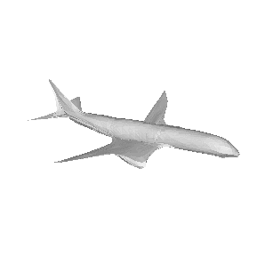
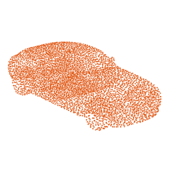

# Pixel2Mesh
This repository contains the TensorFlow implementation for the following paper</br>

[Pixel2Mesh: Generating 3D Mesh Models from Single RGB Images (ECCV2018)](https://arxiv.org/abs/1804.01654)</br>

Nanyang Wang*, [Yinda Zhang](http://robots.princeton.edu/people/yindaz/)\*, [Zhuwen Li](http://www.lizhuwen.com/)\*, [Yanwei Fu](http://yanweifu.github.io/), [Wei Liu](http://www.ee.columbia.edu/~wliu/), [Yu-Gang Jiang](http://www.yugangjiang.info/).

The code is based on the [gcn](https://github.com/tkipf/gcn) framework.

#### Citation
If you use this code for your research, please consider citing:

    @inProceedings{wang2018pixel2mesh,
      title={Pixel2Mesh: Generating 3D Mesh Models from Single RGB Images},
      author={Nanyang Wang and Yinda Zhang and Zhuwen Li and Yanwei Fu and Wei Liu and Yu-Gang Jiang},
      booktitle={ECCV},
      year={2018}
    }

# Project Page
The project page is available at http://bigvid.fudan.edu.cn/pixel2mesh

# Dependencies
Requirements:
* Python2.7+ with Numpy and opencv-python
* [Tensorflow (version 1.0+)](https://www.tensorflow.org/install/)
* [TFLearn](http://tflearn.org/installation/)

Our code has been tested with Python 2.7, **TensorFlow 1.3.0**, TFLearn 0.3.2, CUDA 8.0 on Ubuntu 14.04.

# Installation

    git clone https://github.com/nywang16/Pixel2Mesh.git
    cd Pixel2Mesh
    python setup.py install    

For CD and EMD, we have included the cuda implementations of [Fan et. al.](https://github.com/fanhqme/PointSetGeneration) in external/

    cd pixel2mesh/external/

    Modify the first 3 lines of the makefile to point to your nvcc, cudalib and tensorflow library.

    make


# Running the demo
First, you need download pre-trained models.
* version 1: http://bigvid.fudan.edu.cn/pixel2mesh/eccv2018/checkpoint.zip (https://drive.google.com/file/d/1dJLuHDkhEiFQIClbDw6_qDyyWWe9pGWT/view?usp=sharing)
* version 2: **We will release an improved model in a few days !!**
```
cd pixel2mesh/utils
wget http://bigvid.fudan.edu.cn/pixel2mesh/eccv2018/checkpoint.zip
unzip checkpoint.zip
```

#### Reconstructing shapes
    python demo.py --image utils/examples/plane.png
Run the demo code and the output mesh file is saved in utils/examples/plane.obj 

#### Input image, output mesh


# Dataset

We used the [ShapeNet](https://www.shapenet.org) dataset for 3D models, and rendered views from [3D-R2N2](https://github.com/chrischoy/3D-R2N2):</br>
When using the provided data make sure to respect the shapenet [license](https://shapenet.org/terms).

Below is the complete set of training data. Download it into the utils/ folder.
https://drive.google.com/file/d/1Z8gt4HdPujBNFABYrthhau9VZW10WWYe/view?usp=sharing </br>

    cd pixel2mesh/utils
    tar -xzf ShapeNetTrain.tar


The training/testing split can be found in `utils/train_list.txt` and `utils/test_list.txt` </br>
    
The file is named in syntheticID_modelID_renderID.dat format.

Each .dat file in the provided data contain: </br>
* The rendered image from 3D-R2N2. We resized it to 224x224 and made the background white.
* The sampled point cloud (with vertex normal) from ShapeNet. We transformed it to corresponding coordinates in camera coordinate based on camera parameters from the Rendering Dataset.

**Input image, ground truth point cloud.**</br>



# Training
    python train.py
You can change the training data, learning rate and other parameters by editing `train.py`

# Evaluation
The evaluation code was released, please refer to `eval_testset.py` for more details.

Notice that the 3D shape are downscaled by a factor of 0.57 to generate rendering. As result, all the numbers shown in experiments used 0.57xRaw Shape for evaluation. This scale may be related to the render proccess, we used the rendering data from 3DR2N2 paper, and this scale was there since then for reason that we don't know.

# Statement
This software is for research purpose only. </br>
Please contact us for the licence of commercial purposes. All rights are preserved.

# Contact
Nanyang Wang (nywang16 AT fudan.edu.cn)

Yinda Zhang (yindaz AT cs.princeton.edu)

Zhuwen Li (lzhuwen AT gmail.com)

Yanwei Fu (yanweifu AT fudan.edu.cn)

Yu-Gang Jiang (ygj AT fudan.edu.cn)

